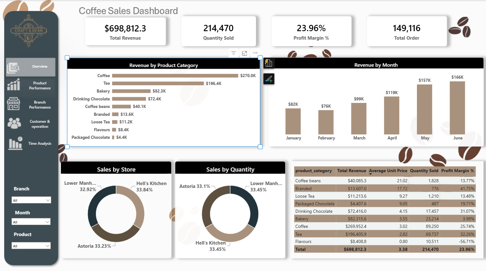
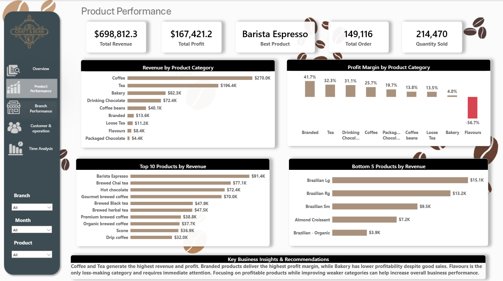
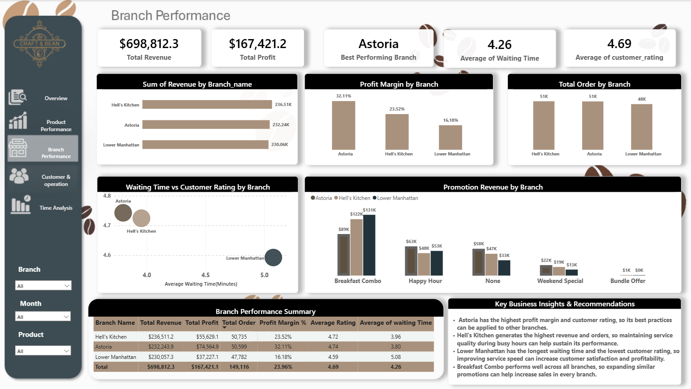
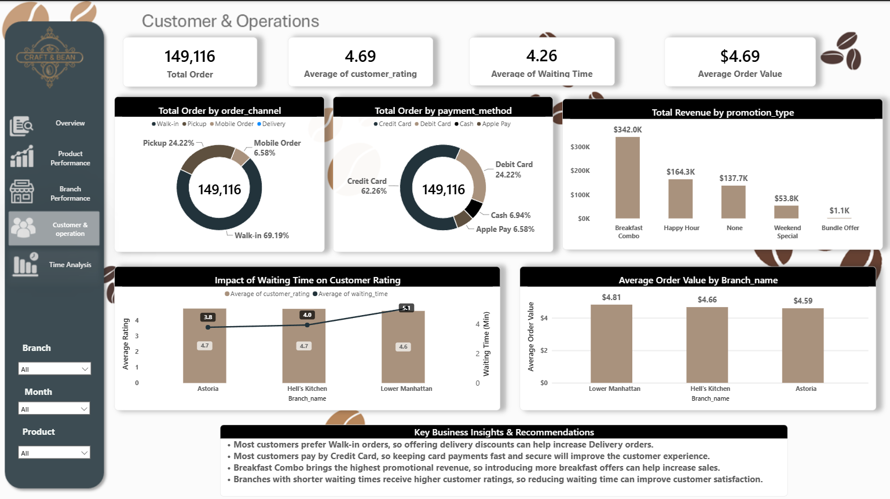
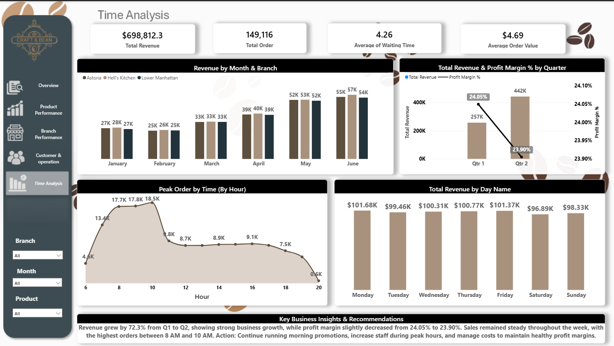

<div align="center">


# ☕ Coffee Shop Sales Analysis


### End-to-End Data Analytics Project using SQL (MySQL) & Power BI


Transforming raw transactional data into actionable business insights through interactive dashboards and business-driven analytics.


<br>


</div>


---


# 📑 Table of Contents


- [📖 About the Project](#-about-the-project)

- [🎯 Business Problems](#-business-problems)

- [💡 Solution](#-solution)

- [📊 Dashboard Preview](#-dashboard-preview)

- [🏗️ Project Architecture](#-project-architecture)

- [🚧 Challenges Faced](#-challenges-faced)

- [📊 Business Insights & Recommendations](#-business-insights--recommendations)

- [📌 Key Takeaways](#-key-takeaways)

- [🛠️ Tech Stack](#️-tech-stack)

- [📂 Project Files](#-project-files)

- [📁 Repository Structure](#-repository-structure)

- [🚀 How to Use](#-how-to-use)

- [📈 Future Improvements](#-future-improvements)


---


# 📖 About the Project


Businesses generate thousands of sales transactions every day, but raw data alone cannot answer important business questions.


This project is an **end-to-end Data Analytics case study** built using **SQL (MySQL)** and **Power BI**. The objective was to analyze **six months of coffee shop sales data** from **three branches in New York City** and transform transactional data into meaningful business insights.


The analysis focuses on understanding:


- 📍 Branch Performance

- ☕ Product Performance

- 👥 Customer Behaviour

- ⚙️ Operational Efficiency

- 📈 Sales Trends


The final deliverable is an interactive **Power BI dashboard** designed to help management monitor KPIs, identify business opportunities, and make data-driven decisions.


---


# 🎯 Business Problems


Although the company maintained detailed transaction records, the data alone could not answer several key business questions.


This project was developed to answer questions such as:


- Which branch performs the best overall?

- Which products contribute the most to revenue and profitability?

- Which product categories require more business attention?

- Are promotional offers improving business performance?

- During which hours does customer traffic reach its peak?

- Which payment methods are preferred by customers?

- Which order channels are used the most?

- Are longer waiting times affecting customer satisfaction?

- Is the business growing consistently over time?


Without proper analysis, management would have to rely on assumptions rather than data while making business decisions.


---


# 💡 Solution


To answer these questions, the dataset was first analyzed using SQL to identify patterns, calculate KPIs, and compare business performance across different dimensions.


The findings were then transformed into an interactive **Power BI dashboard**.


Instead of creating multiple dashboards that repeated the same information, the report was divided into **five business-focused pages**, where each page answers a different business question.


This storytelling approach allows stakeholders to move from a high-level business overview to detailed operational insights in a logical and intuitive manner.


---


# 📊 Dashboard Preview


The Power BI report consists of **five interactive dashboard pages**, each designed to answer a unique business question.


---


## 📊 Executive Overview


Provides a high-level summary of overall business performance through KPIs, revenue trends, branch comparison, and business growth.


<p align="center">



</p>


---


## ☕ Product Performance


Analyzes product categories, top-performing products, profitability, and product contribution to overall business performance.


<p align="center">



</p>


---


## 🏪 Branch Performance


Compares all three branches using revenue, profit margin, customer ratings, waiting time, and operational efficiency.


<p align="center">



</p>


---


## 👥 Customer & Operations


Explores customer behaviour, payment methods, order channels, waiting time, promotions, and customer satisfaction.


<p align="center">



</p>


---


## 📅 Time Analysis


Shows business performance across months, weekdays, weekends, and peak business hours to support operational planning.


<p align="center">



</p>


---


# 🏗️ Project Architecture


The project follows a structured analytics workflow, starting from raw transactional data and ending with an interactive dashboard for business users.


```text

Coffee Shop Sales Dataset

            │

            ▼

      SQL (MySQL)

Data Cleaning & Exploration

            │

            ▼

 Business Analysis

 KPI Calculations

 Trend Analysis

            │

            ▼

      Power BI

Data Modeling & Visualization

            │

            ▼

 Interactive Dashboard

            │

            ▼

 Business Insights &

Recommendations

```


Each stage of the project builds upon the previous one, ensuring that the final dashboard is supported by validated business analysis rather than assumptions.


---


# 🗄️ SQL Analysis


SQL was the foundation of this project.


Instead of importing the dataset directly into Power BI and creating visuals immediately, I first explored the data using SQL to understand how the business was performing.


The SQL analysis focused on answering practical business questions rather than simply retrieving records.


### Analysis Performed


- Revenue Analysis

- Profit Analysis

- Monthly Growth Analysis

- Quarterly Growth Analysis

- Branch Performance Comparison

- Product Performance Analysis

- Product Category Analysis

- Promotion Performance

- Customer Behaviour Analysis

- Payment Method Analysis

- Order Channel Analysis

- Waiting Time Analysis

- Customer Rating Analysis

- Peak Business Hours

- Business KPI Calculations


This helped identify patterns and validate insights before building the dashboard.


---


# 📊 Power BI Dashboard


After completing the SQL analysis, the findings were converted into an interactive Power BI dashboard.


Rather than creating visuals independently, every report page was designed to answer a specific business question.


The dashboard follows a storytelling approach where users begin with the overall business performance and gradually move toward detailed operational insights.


### Dashboard Features


- Interactive KPI Cards

- Dynamic Filters

- Slicers

- Branch Comparison

- Product Analysis

- Customer Behaviour Analysis

- Time-Based Analysis

- Business Performance Tracking


The dashboard allows management to explore the data from different perspectives without writing SQL queries.


---


# 🔄 Project Workflow


The project followed the following workflow.


```

Business Problem

        │

        ▼

Understand Dataset

        │

        ▼

SQL Data Exploration

        │

        ▼

Business Analysis

        │

        ▼

KPI Identification

        │

        ▼

Power BI Dashboard Design

        │

        ▼

Business Insights

        │

        ▼

Recommendations

```


This workflow helped ensure that every visual shown in the dashboard answers a meaningful business question.


---


# 🚧 Challenges Faced


## 1️⃣ Understanding the Business Before Building the Dashboard


One of the biggest challenges was deciding what the dashboard should actually answer.


The dataset contained thousands of transaction records, but creating charts without a clear objective would only produce a collection of visuals rather than a useful business report.


To solve this, I first identified the key questions that management would likely ask, such as branch performance, product profitability, customer behaviour, and business growth. These questions became the foundation of both the SQL analysis and the dashboard design.


---


## 2️⃣ Choosing the Right KPIs


A business cannot be evaluated using a single metric.


For example, a branch with the highest revenue is not necessarily the best-performing branch if it has lower customer ratings or longer waiting times.


Instead of relying on one KPI, I compared multiple business metrics together, including revenue, profit margin, customer ratings, waiting time, and order volume. This provided a more balanced view of branch performance.


---


## 3️⃣ Avoiding Repetitive Visuals


During dashboard development, several visuals answered the same business question, making the report feel repetitive.


To improve the storytelling, each page was redesigned so that every visual answered a different question and contributed new information.


This made the dashboard easier to understand and prevented unnecessary duplication.


---


## 4️⃣ Turning Analysis into Business Recommendations


Finding patterns in data is only part of a Data Analyst's role.


The real challenge was translating analytical findings into recommendations that management could act upon.


For every major insight, I included a practical recommendation based on the analysis so that the dashboard supports business decisions instead of only presenting numbers.


---


## 5️⃣ Keeping the Dashboard Simple


With many available KPIs and charts, it is easy to overcrowd a dashboard.


Instead of adding every possible visualization, I focused on displaying only the metrics that supported the business objectives.


This improved readability while ensuring stakeholders could quickly understand the key findings.


---


# 📊 Business Insights & Recommendations


The analysis uncovered several business trends that can help management improve profitability, customer satisfaction, and operational efficiency.


---


## 📈 Revenue Growth


### Insight


Revenue increased by approximately **72.3%** from **Q1 to Q2**, indicating strong business growth during the second quarter.


### Recommendation


Review the business activities, promotional campaigns, and operational strategies implemented during Q2 to understand what contributed to this growth. Replicating successful initiatives can help sustain long-term business performance.


---


## 🏆 Best Performing Branch


### Insight


Among all three branches, **Astoria** achieved:


- Highest Profit Margin

- Highest Customer Rating

- Shortest Waiting Time


Although it did not generate the highest revenue, its strong operational performance makes it the best-performing branch overall.


### Recommendation


Analyze Astoria's day-to-day operations and use it as a benchmark for the other branches. Adopting similar service practices could improve customer experience across the business.


---


## 💰 Highest Revenue Branch


### Insight


**Hell's Kitchen** generated the highest revenue and processed the largest number of customer orders.


This indicates strong customer demand and high sales activity.


### Recommendation


Maintain sufficient staffing levels and inventory during busy periods to avoid service delays and support future business growth.


---


## ⏳ Operational Improvement Opportunity


### Insight


**Lower Manhattan** recorded:


- Longest Waiting Time

- Lowest Customer Rating


The relationship between longer waiting times and lower customer satisfaction suggests an opportunity to improve operational efficiency.


### Recommendation


Review staffing schedules, service workflow, and order preparation during peak hours to reduce waiting times and improve the customer experience.


---


## ☕ Product Performance


### Insight


The **Coffee & Tea** category generated the highest revenue, while **Barista Espresso** was the best-performing individual product.


These products make a significant contribution to overall sales.


### Recommendation


Maintain adequate inventory, highlight these products in promotional campaigns, and ensure consistent availability during peak business hours.


---


## 📉 Low Performing Category


### Insight


The **Flavours** category generated the lowest revenue compared to other product categories.


### Recommendation


Review customer demand, pricing strategy, and promotional activities for this category. If performance remains consistently low, management may consider revising the product mix.


---


## 💳 Customer Behaviour


### Insight


Most customers preferred **Walk-in** orders, while **Credit Card** was the most commonly used payment method.


This indicates that the majority of customers continue to prefer purchasing directly from the store.


### Recommendation


Continue investing in the in-store customer experience while ensuring reliable and efficient card payment systems.


---


## 🕗 Peak Business Hours


### Insight


Customer traffic was highest between **8:00 AM and 10:00 AM**.


This represents the busiest period of the day across all branches.


### Recommendation


Schedule additional staff during these hours and ensure sufficient stock availability to minimize waiting times and maintain service quality.


---


# 📌 Key KPIs Tracked


The dashboard monitors the following business metrics to evaluate overall performance.


| KPI | Purpose |

|------|---------|

| 💰 Total Revenue | Measures total sales generated during the analysis period |

| 📈 Profit | Evaluates overall profitability |

| 📊 Profit Margin | Measures business efficiency after costs |

| 🛒 Total Orders | Tracks customer transactions |

| 📦 Quantity Sold | Measures total products sold |

| ⭐ Customer Rating | Evaluates customer satisfaction |

| ⏳ Waiting Time | Monitors operational efficiency |

| 💳 Payment Method | Understands customer payment preferences |

| 🚶 Order Channel | Identifies customer ordering behaviour |


---


# 🎯 Key Takeaways


This project demonstrates how transactional sales data can be transformed into meaningful business insights using SQL and Power BI.


Rather than focusing only on reporting sales figures, the analysis identifies opportunities to improve operational efficiency, customer satisfaction, product performance, and overall profitability.


The project also highlights the importance of combining technical analysis with business understanding to support data-driven decision making.


---


# 🛠️ Tech Stack


| Technology | Purpose |

|------------|---------|

| MySQL | Data Exploration, SQL Queries, KPI Calculations, Business Analysis |

| Power BI | Interactive Dashboard, Data Visualization, Business Reporting |


---


# 📂 Project Files


The repository is organized to make it easy to explore the analysis, dashboard, and dataset.


| File | Description |

|------|-------------|

| 📊 `PowerBI/coffee-shop-sales-dashboard.pbix` | Interactive Power BI dashboard containing all report pages and visualizations. |

| 🗄️ `SQL/coffee-shop-sales-analysis.sql` | SQL queries used to explore the dataset and answer business questions. |

| 📄 `Data/coffee-shop-sales.csv` | Dataset used for the analysis. |

| 🖼️ `Images/` | Dashboard screenshots used in this README. |


---


# 📁 Repository Structure


```text

Coffee-Shop-Sales-Analysis/

│

├── README.md

├── LICENSE

│

├── Data/

│   └── coffee-shop-sales.csv

│

├── SQL/

│   └── coffee-shop-sales-analysis.sql

│

├── PowerBI/

│   └── coffee-shop-sales-dashboard.pbix

│

└── Images/

    ├── overview.png

    ├── product-performance.png

    ├── branch-performance.png

    ├── customer-operations.png

    └── time-analysis.png

```


---


# 🚀 How to Use


### Clone the Repository


```bash

git clone https://github.com/your-username/Coffee-Shop-Sales-Analysis.git

```


---


### Open the Dashboard


Open the **Power BI (.pbix)** file using **Power BI Desktop**.


```

PowerBI/

└── coffee-shop-sales-dashboard.pbix

```


---


### Explore the Dashboard


Use the available slicers and filters to explore the business from different perspectives.


You can analyze:


- Branch Performance

- Product Performance

- Customer Behaviour

- Revenue Trends

- Profitability

- Peak Business Hours

- Operational Efficiency


---


### Review the SQL Analysis


Open the SQL script to understand how the business questions were answered before building the dashboard.


```

SQL/

└── coffee-shop-sales-analysis.sql

```


---


### Explore the Dataset


The original transactional dataset is available inside the **Data** folder.


```

Data/

└── coffee-shop-sales.csv

```


---


# 📈 Future Improvements


If additional business data becomes available, the project can be expanded further by adding:


- Year-over-Year (YoY) sales comparison

- Sales forecasting using historical trends

- Customer segmentation and RFM analysis

- Inventory optimization

- Live SQL database connection

- Automated dashboard refresh through Power BI Service

- Predictive analytics for demand forecasting


---


# 👨‍💻 About Me


I am a Data Analyst passionate about solving business problems through data.


This project reflects my approach to analytics—starting with understanding the business problem, validating insights through SQL, and presenting the findings in an interactive Power BI dashboard that supports decision-making.


I'm continuously improving my skills in SQL, Power BI, Excel, and Python while building projects that focus on practical business scenarios.


---


# 🤝 Connect With Me


- 💼 LinkedIn: *(Add your LinkedIn profile here)*

- 📧 Email: *(Add your email here)*

- 🌐 GitHub: *(Add your GitHub profile here)*


---


<div align="center">


## ⭐ Thank You for Visiting!


Thank you for taking the time to explore this project.


If you found this repository helpful or interesting, consider giving it a ⭐ on GitHub.


Feedback and suggestions are always welcome.


**Happy Exploring! ☕📊**


</div>

